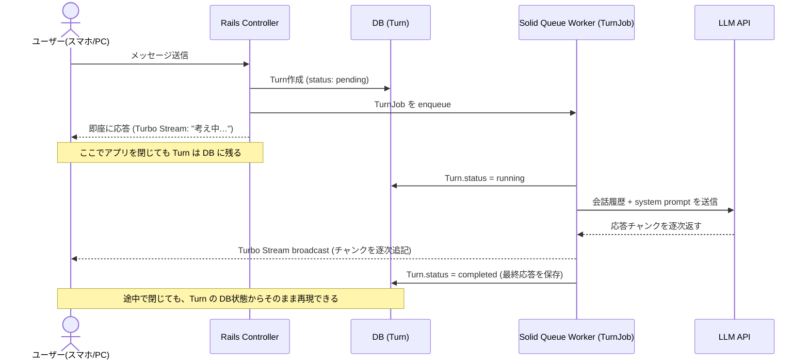

# ADR-0005: Turbo Streams による進捗反映

## Status

Superseded by [ADR-0008](0008-pivot-to-ruby-playground.md) (2026-08-22)

## Context

[ADR-0003](0003-async-execution.md) で非同期実行を決めたことを受け、実行中のturnの進捗 (生成中のテキスト) をブラウザにどう反映するかを検討した。候補は次の3つ:

- **案A: Turbo Streams broadcast** — Solid QueueのTurnJobが、応答チャンクを受け取るたびにRails/Hotwire標準の仕組みでHTML片をbroadcastし、ブラウザが自動で受け取って追記する
- **案B: 素のActionCable** — 同じ配信の仕組み (ActionCable) を使うが、Channelクラスとブラウザ側JSを自前で書く
- **案C: polling** — ブラウザが定期的にRailsへ「今どこまで進んどるか」を問い合わせる

判断軸として次の5本を設定した:

- **応答性**: 生成された文字がブラウザに届くまでの速さ
- **回復性**: ネットワーク瞬断等で更新を1回取りこぼしたとき、正しい状態に復帰できるか
- **整合性**: 複数タブ/端末で同時に見たとき、同じ状態に見えるか (結果整合性で十分という要件のもとで評価)
- **拡張性**: 複数端末での同時視聴、将来のStep単位進捗表示への転用のしやすさ
- **試験性**: 状態遷移や配信をテストで検証しやすいか

案Bは案Aに全軸で同等以下 (dominated) となり、優先順位を問うまでもなく機械的に脱落した。案Aと案Cの比較では、当初「整合性」で案Cが優位だったが、「結果整合性で十分」という要件確認により案Aの整合性評価が上がり、最終的に案Aが応答性・整合性・拡張性・試験性の4軸で◯、案Cは回復性のみで優位という結果になった。「chatGPTライク」な生成中テキストの逐次表示という体験そのものが応答性を要求することから、案Aを採用した。

## Decision

Solid QueueのTurnJobが、LLMからの応答チャンクを受け取るたびにTurbo Streamsでブラウザに逐次broadcastする。回復性の弱さ (配信保証がない) は、再接続時に現在のDB状態を再描画するパターンで補う。

### 実行フロー (MVP、tool呼び出し無し)

tool呼び出しを含む詳細フロー (Step作成込み) はpost-MVP (論点E) で扱う。

## Consequences

- 複数タブ/端末での同時視聴、将来のStep単位進捗表示への拡張が自然に行える
- 再接続時の現在状態再描画ロジックを実装する必要がある

## Update (2026-08-22): Redis不要と判明

`rails new` で実際にscaffoldした結果、Rails 8のデフォルト構成では ActionCable のアダプタは development で `async` (プロセス内完結)、production でも Redis やなく **Solid Cable** (SQLiteベースの `solid_cable` gem) やった。Context/Decision時点では「ActionCable (Redis等) のインフラが必要」と想定していたが、これは誤りだったため訂正する。Redisは導入しない。

